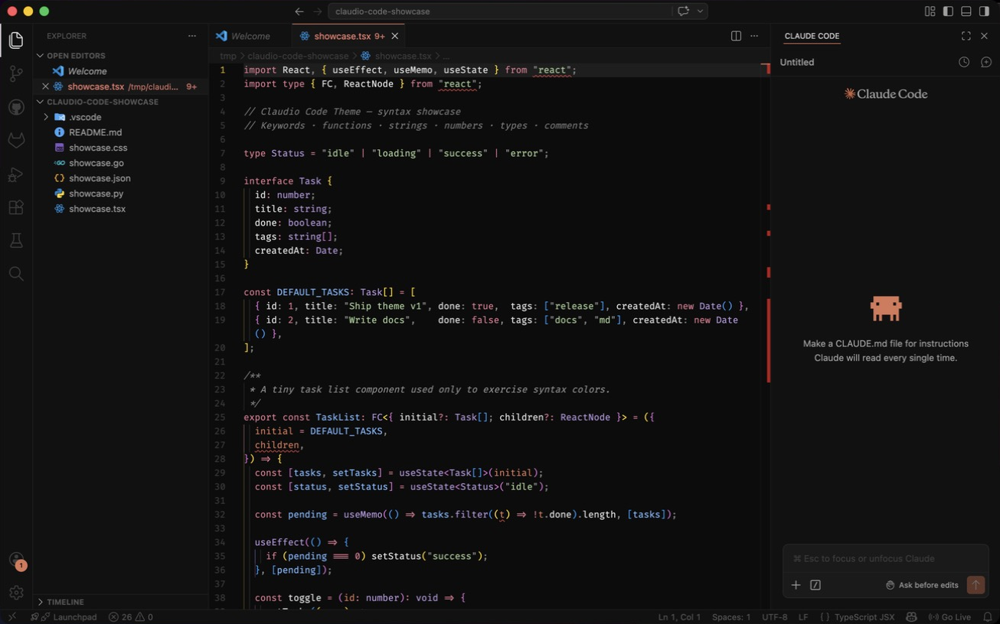
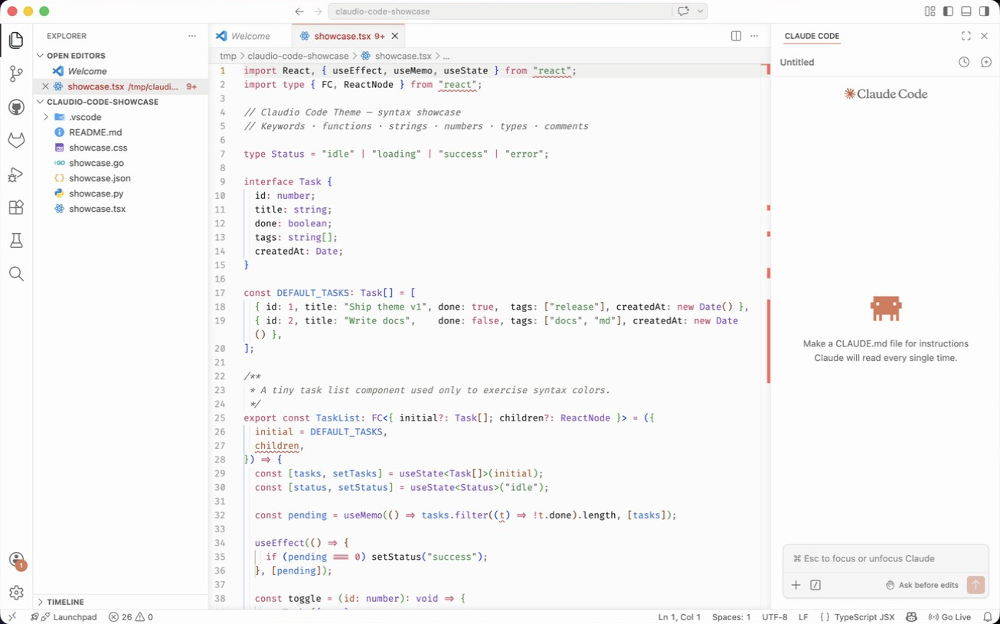

<p align="center">
  
</p>

<h1 align="center">Claudio Code Theme</h1>

<p align="center">A warm terracotta-and-cream theme pair for VS Code — soft backgrounds, pastel syntax, and muted accents for long coding sessions.</p>

## Why

This theme was created right after Anthropic shipped the **Claude Code desktop redesign** on **April 14, 2026** — a full rebuild of the desktop app around parallel agent sessions, with a refreshed visual identity: warm near-black surfaces, terracotta accents, and a calmer pastel palette for syntax. The new look was striking enough to want it everywhere, so this theme ports the same language to VS Code.

## Variants

| Variant | Use case |
|---|---|
| **Claudio Code Dark** | Low-light environments and long focus sessions — near-black background, cream text, terracotta accents |
| **Claudio Code Light** | Daytime and bright rooms — warm off-white background, dark text, same terracotta accent for visual continuity |

### Preview

<p align="center">
  
  &nbsp;
  
</p>

## Install

### From the Marketplace (CLI)

```bash
code --install-extension matheus-teles.claudio-code-theme
```

Then open the Command Palette (`Cmd+Shift+P` / `Ctrl+Shift+P`) → **Preferences: Color Theme** → choose **Claudio Code Dark** or **Claudio Code Light**.

### From source (local .vsix)

```bash
git clone https://github.com/matheustdo/claudio-code-theme.git
cd claudio-code-theme
npx @vscode/vsce package
code --install-extension claudio-code-theme-*.vsix
```

## Project Info

- **Maintainer:** [Matheus Teles](https://github.com/matheustdo)
- **Repository:** [matheustdo/claudio-code-theme](https://github.com/matheustdo/claudio-code-theme)
- **Marketplace:** Claudio Code Theme
- **License:** [MIT](./LICENSE)
